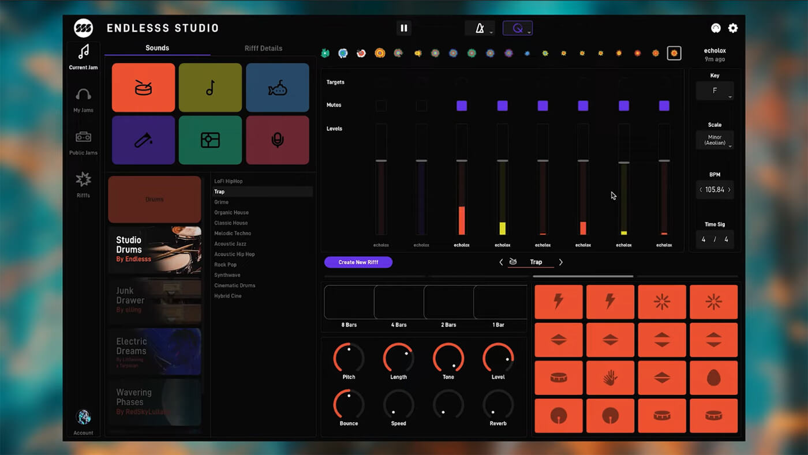

# PAC3 – Manovich Reloaded

**Autor:** Nikoloz Elkanishvili  
**Usuari GitHub:** Niikzz  
**Aula:** 1  
**Títol del treball:** _Endlesss i Fortnite x Travis Scott – Noves formes de remediació digital_

---

## Introducció

A partir dels conceptes de Lev Manovich sobre la remediació, la transcodificació i la cultura digital híbrida, analitzem dues obres digitals contemporànies que exemplifiquen com la tecnologia ha transformat radicalment la creació i consum de continguts: **Endlesss**, una app de creació musical col·laborativa, i el **concert de Travis Scott dins de Fortnite**, un esdeveniment transmediàtic sense precedents. Aquestes obres funcionen com a nous capítols de l’univers teòric de Manovich, on la frontera entre creador i espectador, art i codi, realitat i simulació es difumina completament.

---

## 📱 **CAS 1: Endlesss – La remediació de la jam session**

**Descripció:**  
Endlesss és una plataforma musical en forma d'app que permet a usuaris de tot el món improvisar música en temps real col·laborativament. Creat pel productor Tim Exile, combina elements de xarxa social, seqüenciador digital i comunitat creativa. L'app permet crear “riffes” i respondre-les de manera asincrònica o en directe, com si fos una jam session virtual.

**Remediació i hibridació:**  
Endlesss és un clar exemple de remediació de la cultura musical analògica i col·laborativa (les jam sessions) dins un entorn digital gamificat i connectat. Integra formats com:

- Interfícies de sintetitzador (DAW)
- Streaming en directe
- Elements visuals minimalistes
- Funcions socials similars a Instagram

Aquesta obra remedia l’estudi de gravació, el xat i el fòrum musical en una sola aplicació.

**Anàlisi crítica:**  
Seguint Manovich, la transcodificació es fa evident: l’objecte cultural tradicional (la música en grup) passa per una capa digital programada amb normes noves. El temps real i la participació global són la clau de la seva innovació. L’usuari deixa de ser un consumidor per ser part activa de la creació, en un entorn on el software és qui marca les regles del joc creatiu.

**Enllaç:**  
🔗 https://endlesss.fm/

**Imatge:**  

---

## 🎮 **CAS 2: Travis Scott x Fortnite – El concert jugable**

**Descripció:**  
L’abril de 2020, en plena pandèmia, Fortnite va organitzar un concert virtual de Travis Scott dins el seu món interactiu. Més de 12 milions d’usuaris van assistir-hi en directe des de dins del joc, on l’escenari, la narrativa visual i les mecàniques es van integrar per oferir una experiència única: un concert jugable i espectacular.

**Remediació i transcodificació:**  
Aquest concert és una remediació múltiple: la música en directe, el videoclip musical i l’esdeveniment cultural s’integren dins d’un videojoc. La posada en escena es va generar amb motors gràfics i va permetre una interacció impossible en concerts físics: gravetat zero, canvis d’escala, immersió aquàtica i transicions visuals espectaculars.

**Anàlisi crítica:**  
L’obra redefineix els límits de l’escenografia i la posada en escena. La tecnologia del motor Unreal Engine converteix el concert en una experiència coreografiada a nivell tècnic, visual i emocional. El públic no observa: _habita_. Com diu Manovich, el disseny de la interfície esdevé part del missatge. Aquesta obra mostra la convergència total entre cultura del joc, indústria musical i creació multimèdia.

**Vídeo resum:**  
🔗 https://www.youtube.com/watch?v=wYeFAlVC8qU

**Imatge:**  

---

## Conclusions

Tant Endlesss com Fortnite x Travis Scott són exemples paradigmàtics de la nova era digital que Manovich anunciava. En tots dos casos, la tecnologia no només acompanya la creació artística: **la determina**. El codi i les interfícies són els nous pinzells. A través d’aquests casos veiem com les narratives digitals contemporànies no només remedeien, sinó que superen els suports tradicionals, creant experiències impossibles en el món físic. L’espectador és part de l’obra, i l’obra és part de l’algoritme.

---

## Bibliografia

- Manovich, L. (2001). *The Language of New Media*. MIT Press.  
- Manovich, L. (2008). *Software Takes Command*. Bloomsbury.  
- Endlesss.fm – [https://endlesss.fm/](https://endlesss.fm/)  
- Fortnite Fandom – Travis Scott x Fortnite – [https://fortnite.fandom.com/wiki/Travis_Scott%27s_Astronomical)  
